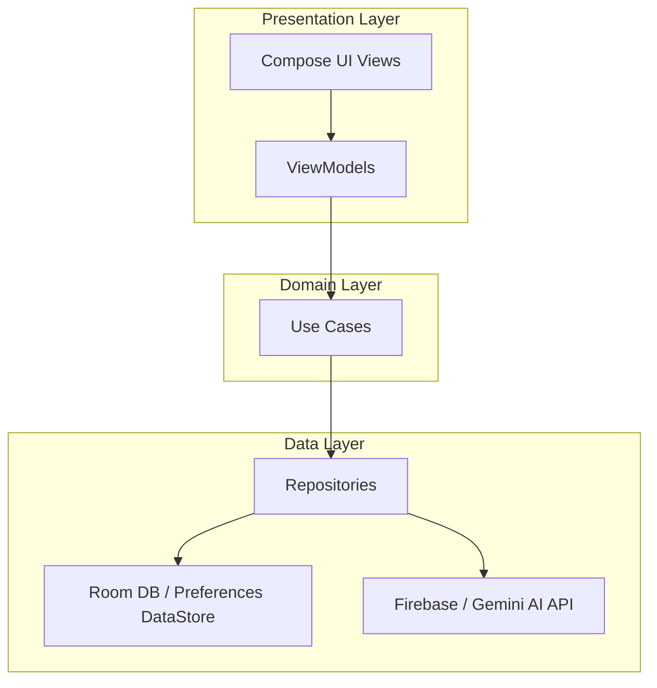

# ⚡ Grama-Urja (ಗ್ರಾಮ ಊರ್ಜಾ) — Smart Village Power Monitor

Grama-Urja is a state-of-the-art Android mobile application designed to empower rural communities with real-time power grid monitoring, automated farm equipment management, and predictive grid analytics. Built with modern Android architecture guidelines, Jetpack Compose, and powered by Gemini AI, it helps farmers and village administrators efficiently manage resources during intermittent power cycles.

---

## 📸 Application Preview
*A modern, responsive design optimized for high readability, accessibility, and offline resilience in rural environments.*

```
+-------------------------------------------------------------------+
|  ⚡ ಗ್ರಾಮ ಊರ್ಜಾ (Grama-Urja)                                        |
+-------------------------------------------------------------------+
|  [ Current Status: Active 🟢 ]       [ Zone: Mandya East Sector ]   |
|                                                                   |
|  Power Availability: Available (3-Phase)                           |
|  Voltage: 415 V  |  Frequency: 50.1 Hz                            |
|                                                                   |
|  +-------------------------------------------------------------+  |
|  |                    Power Prediction (Gemini)                |  |
|  |  "Expected power outage between 2:00 PM and 4:30 PM due to   |  |
|  |  peak load agricultural activity."                          |  |
|  +-------------------------------------------------------------+  |
|                                                                   |
|  +--------------------+   +--------------------+   +-----------+  |
|  | ⏱️ Pump Timer       |   | 📊 Grid Analytics  |   | 🗺️ Maps    |  |
|  | Active: 2h remaining|   | View voltage history|   | Substation|  |
|  +--------------------+   +--------------------+   +-----------+  |
+-------------------------------------------------------------------+
```

---

## 🌟 Key Features

### 🟢 Real-time Grid Monitoring
* **Live Status Tracking:** Connects to Firebase Realtime Database to display instant grid metrics (active phases, line voltage, frequency).
* **Grid Alerts:** Receives instantaneous notifications via Firebase Cloud Messaging (FCM) when power shuts down or returns, enabling farmers to act immediately.

### ⏱️ Smart Pump Timer & Automation
* **Irrigation Scheduler:** Configure active schedules and duration countdowns for water pumps so they operate only when safe, stable 3-phase power is active.
* **Safety Shutoff:** Protects motor pumps from damage by shutting down the software timer and alerting the user during voltage drops or phase failures.

### 🧠 Gemini AI Power Predictions
* **AI-Driven Forecasts:** Leverages Google Generative AI (Gemini SDK) to analyze localized historical power outage data and predict availability windows.
* **Smart Recommendations:** Recommends optimal times to operate heavy machinery or run irrigation pumps based on predicted load patterns.

### 🌐 Dual-Language Accessibility (English & ಕನ್ನಡ)
* **Localized Context:** Complete local language translation support (Kannada) across the entire application interface to maximize accessibility for rural users.

### 📊 Interactive Grid Analytics
* **Visual Reports:** Renders beautiful, interactive historical charts using `MPAndroidChart` to plot voltage stability and uptime metrics.

### 🗺️ Interactive Substation Mapping
* **Geographical Assets:** Integrates Google Maps Compose to display power transformers, agricultural feeders, and zone boundaries for localized maintenance updates.

---

## 🏗️ Architecture & Design System

The application follows the **MVVM (Model-View-ViewModel)** architectural pattern adhering strictly to **Clean Architecture** principles.



### Technical Highlights:
* **Presentation Layer (Jetpack Compose):** A declarative UI layout built with smooth state transitions, beautiful gradient backdrops, and modern Material 3 design tokens.
* **Domain Layer (Use Cases):** Pure business logic isolated from frameworks, databases, and network adapters.
* **Data Layer (Offline-First):** Uses Repository Pattern to abstract data storage. Retrieves local cache from **Room Database** while syncing updates in the background.
* **Dependency Injection (Dagger Hilt):** Simplifies construction of singletons, repository instances, and view models.
* **Asynchronous Streams (Kotlin Coroutines & Flow):** Drives reactive UI updates, handling asynchronous web service calls cleanly without UI-blocking.

---

## 🛠️ Technology Stack

| Component | Technology | Description |
|---|---|---|
| **Language** | [Kotlin](https://kotlinlang.org/) | Modern, expressive language for Android development. |
| **UI Framework** | [Jetpack Compose](https://developer.android.com/compose) | Declarative native UI toolkit. |
| **DI Engine** | [Dagger Hilt](https://developer.android.com/training/dependency-injection/hilt-android) | Standard dependency injection library for Android. |
| **Local Database** | [Room Database](https://developer.android.com/training/data-storage/room) | SQLite abstraction layer for robust offline caching. |
| **Preferences** | [Preferences DataStore](https://developer.android.com/topic/libraries/architecture/datastore) | Modern key-value storage replacing SharedPreferences. |
| **Cloud Integration** | [Firebase Suite](https://firebase.google.com/) | Realtime Database, Firebase Auth, Analytics, and Cloud Messaging (FCM). |
| **AI Integration** | [Google Generative AI SDK](https://ai.google.dev/) | Direct integration with Gemini models for power grid forecasting. |
| **Visualization** | [MPAndroidChart](https://github.com/PhilJay/MPAndroidChart) | Renders clean data visualizations for power grid availability history. |
| **Background Sync** | [WorkManager](https://developer.android.com/topic/libraries/architecture/workmanager) | Guarantees background sync of grid logs even when the app is closed. |

---

## 📂 Project Structure

A comprehensive walkthrough of the Grama-Urja codebase:

```directory
Grama-Urja/
├── app/
│   ├── google-services.json          # Firebase Configuration File
│   ├── build.gradle.kts              # Application-specific dependencies and build configs
│   └── src/
│       ├── main/
│       │   ├── AndroidManifest.xml   # Application manifest file
│       │   ├── java/com/gramaurja/
│       │   │   ├── GramaUrjaApp.kt   # Hilt Application container class
│       │   │   ├── MainActivity.kt   # Main Entry Activity setting up navigation graphs
│       │   │   │
│       │   │   ├── data/                 # Data Layer
│       │   │   │   ├── local/            # Room Database, DAOs, and Preferences DataStore
│       │   │   │   ├── model/            # Data entities (Zone, PowerHistory, PowerStatus)
│       │   │   │   └── repository/       # Repository implementations fetching from APIs/Local DB
│       │   │   │
│       │   │   ├── domain/               # Domain Layer
│       │   │   │   └── usecase/          # Interactors handling grid checks, predictions, status updates
│       │   │   │
│       │   │   ├── di/                   # Dependency Injection
│       │   │   │   └── Modules.kt        # Hilt bindings for network client, database, & repository
│       │   │   │
│       │   │   ├── presentation/         # UI Presentation Layer
│       │   │   │   ├── components/       # Custom shared Compose components
│       │   │   │   ├── navigation/       # Navigation routes (NavHost, Screen graph)
│       │   │   │   ├── screens/          # Screen-specific ViewModels and Composable UIs
│       │   │   │   └── theme/            # Accent Colors, Typography styles, and Theme configurations
│       │   │   │
│       │   │   ├── service/              # Services
│       │   │   │   └── MessagingService. # Listens to incoming FCM power alert notifications
│       │   │   │
│       │   │   └── worker/               # Background Workers
│       │   │       └── SyncWorker.kt     # Handles background updates and offline grid synchronization
│       │   │
│       │   └── res/                  # App Resources (Drawables, Strings, Layout configurations)
│       │       ├── values/           # Default resources (English strings, colors)
│       │       └── values-kn/        # Localized Kannada translation strings
```

---

## ⚙️ Local Setup Guide

Follow these steps to configure and build Grama-Urja locally:

### 1. Prerequisites
* **Android Studio** Ladybug (2024.2.1) or newer.
* **JDK 17** configured in your development environment.
* A active **Firebase Project** with Realtime Database, Authentication, and FCM enabled.

### 2. Clone the Repository
```bash
git clone https://github.com/ShaliniGV18/Grama-Urja.git
cd Grama-Urja
```

### 3. Add Configurations & API Keys
Create a `local.properties` file in the project's root folder if it doesn't already exist and configure your Gemini & Google Maps tokens:
```properties
sdk.dir=YOUR_ANDROID_SDK_PATH
GEMINI_API_KEY=YOUR_GEMINI_API_KEY
MAPS_API_KEY=YOUR_GOOGLE_MAPS_API_KEY
```
*(Make sure to replace the values above with your actual development keys. `local.properties` is git-ignored to prevent key leakage).*

### 4. Setup Firebase Credentials
1. Go to your [Firebase Console](https://console.firebase.google.com/).
2. Register an Android Application with package name `com.gramaurja`.
3. Download the configuration file `google-services.json`.
4. Place the downloaded `google-services.json` directly into the `app/` folder:
   ```path
   Grama-Urja/app/google-services.json
   ```

### 5. Build and Launch
1. Open the project folder in **Android Studio**.
2. Wait for Gradle to download dependencies and sync files.
3. Select an Emulator (API 30+) or connect a physical Android device.
4. Click **Run** (`Shift + F10`) to compile and launch the app.

---

## 🔐 Contribution Guidelines & Standards

* **Keep Secrets Safe:** Under no circumstances should secrets/keys be added to the code or committed to remote repositories. Use configuration variables inside `local.properties` which are referenced during compilation.
* **Clean Code Practices:** Respect separation of concerns:
  * Views should only contain composable functions and observe view model states.
  * ViewModels should only handle presentation states and communicate with UseCases.
  * UseCases must remain isolated from direct database queries or HTTP endpoints.
* **Resource Localization:** Always add localized translation keys inside `res/values-kn/strings.xml` when creating or modifying UI text, ensuring accessibility for all users.

---

## 📄 License
This project is open-source and available under the [MIT License](LICENSE).
